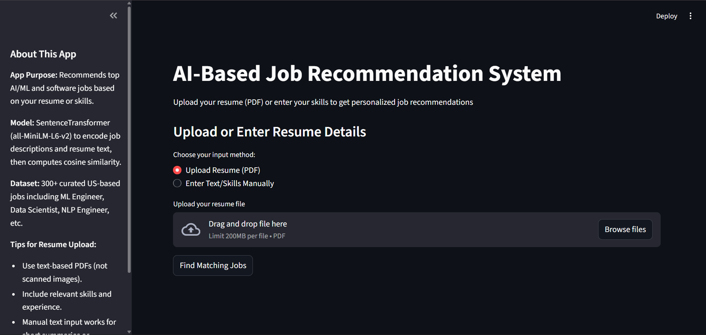
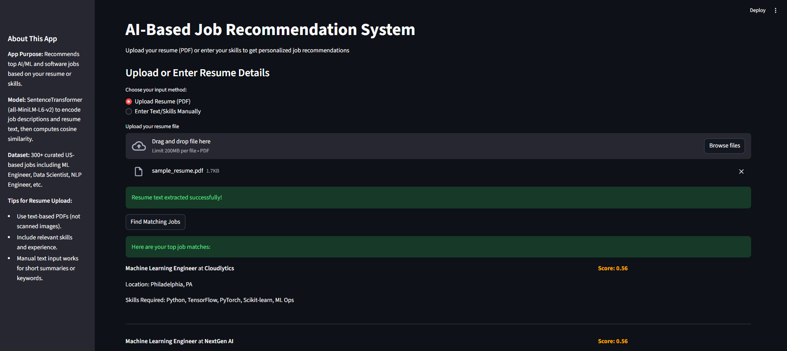
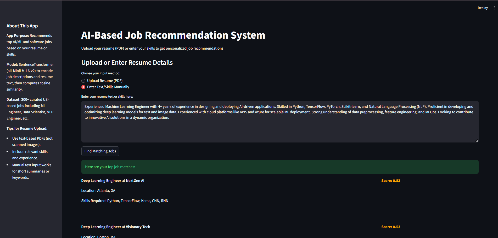

# AI-Based-Job-Recommendation-System
This is a sample project that showcases an AI-powered job recommendation system built with SentenceTransformer and locally hosted on Streamlit. The web app recommends relevant AI/ML and software engineering jobs based on your resume text or skills input, matching your profile with the closest job descriptions using semantic similarity.

Project Overview
----------------
The system uses SentenceTransformer (all-MiniLM-L6-v2) to convert job descriptions and resumes into embeddings and computes cosine similarity to find the most relevant matches. It was trained on a synthetic dataset of over 300 U.S.-based tech jobs, including roles like Machine Learning Engineer, Data Scientist, NLP Engineer, Software Developer, AI Researcher etc..

Workflow
-------------
-Input: Resume uploaded as PDF or skills entered manually via the Streamlit app.

-Model Architecture: SentenceTransformer (all-MiniLM-L6-v2).

-Output: Top job matches with similarity scores, locations, and key skills required.

Files in Repository
-------------------
-app.py: Streamlit web application for local usage

-model_jobrec.py: Core model for job embedding and recommendation

-requirements.txt: Required packages to be installed

Steps to run the program 
------------------------
1. Clone this repository to your local machine:

    git clone <repository_url>
    
    cd AI-Based-Job-Recommendation-System

2. Download the trained model zip file (trained_model.zip) from [Google Drive ([https://drive.google.com/file/d/1K_LzTD1OH5MbVHaFtPSICR_lacUGtZnK/view?usp=drive_link])

3. Install the required packages:

     pip install -r requirements.txt

4. Run the Streamlit app locally:
   
    streamlit run streamlit_animal.py

5. Upload the resume or enter skills as text through the app to obtain recommendations with similarity scores.

Screenshots
-----------
1. Webapp interface

2. Resume Upload & Prediction

3. Text Upload & Prediction

Acknowledgments
---------------
-Model: SentenceTransformers - all-MiniLM-L6-v2

-Framework: Streamlit for web interface

-Dataset: Curated from multiple AI/ML job listings

Results
-------
The recommendation system provides highly relevant job matches, achieving an average similarity score of 0.40 across the dataset, with top matches often exceeding 0.70.

Model Details
--------------
The equation that explains the model's learning process is:

similarity = cosine_similarity(resume_embedding, job_embeddings)

where,

-resume_embedding → Vector representation of the user's resume text.

-job_embeddings → Vector representations of all job descriptions in the dataset.

-cosine_similarity → Measures how similar two vectors are based on their angle.

-similarity → The resulting similarity scores between the resume and each job posting.

Feature Importance Analysis
---------------------------
After training, the following features were found to have the most significant influence on the job recommendations based on similarity score:

| Skill Area           |  Skill sets                             |
| -------------------- | --------------------------------------- |
| Machine Learning     | TensorFlow, PyTorch, Scikit-learn       |
| NLP                  | Transformers, BERT, Text Classification |
| Data Science         | Pandas, NumPy, Data Visualization       |
| Software Development | Python, APIs, Flask, Git                |
| Cloud/DevOps         | AWS, Docker, CI/CD                      |

Model Performance
-----------------
The SentenceTransformer-based model achieved an average cosine similarity of 0.405 across all job embeddings, with values ranging from 0.091 (minimum) to 1.000 (maximum). For sample resumes, the top 5 job matches consistently reached similarity scores around 0.70, reflecting strong alignment between candidate profiles and job descriptions. The model provides accurate, fast, and matching recommendations for tech roles within a short duration.

